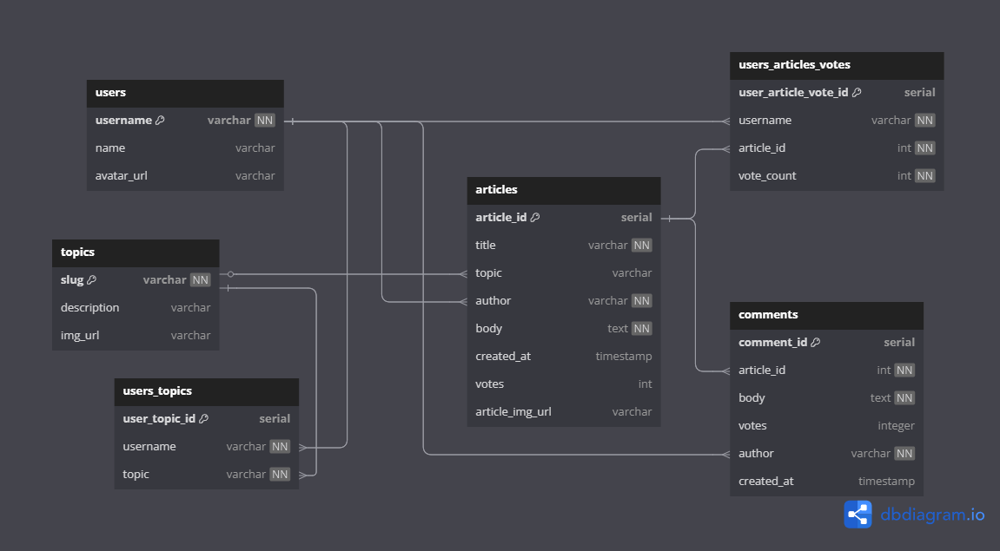

# MTL News Server

[MTL News Server backend API](https://mtl-news-backend.onrender.com/)

## Summary

This project is a simple news server API, written in JavaScript and accessing a PostgreSQL database. The application has the following backend functionality:

- Topics
- Users
- Articles
- Comments on articles
- Votes on articles

Error handling is incorporated, and the repo includes test scripts.

## Endpoints

| Method | Endpoint                             | Description                                                                     |
| ------ | ------------------------------------ | ------------------------------------------------------------------------------- |
| GET    | `/api`                               | Documentation of available API endpoints                                        |
| GET    | `/api/topics`                        | Get all topics                                                                  |
| GET    | `/api/users`                         | Get all users                                                                   |
| GET    | `/api/users/:username`               | Get a user by their username                                                    |
| GET    | `/api/articles`                      | Get all articles (sorting asc/desc by columns and filtering by topic available) |
| GET    | `/api/articles/:article_id`          | Get an article by its ID                                                        |
| GET    | `/api/articles/:article_id/comments` | Get all comments for an article                                                 |
| POST   | `/api/articles/:article_id/comments` | Add a comment for an article                                                    |
| PATCH  | `/api/articles/:article_id`          | Update the votes on an article by its ID                                        |
| DELETE | `/api/comments/:comment_id`          | Delete a comment by its id                                                      |

## Setup Guide

### Prerequisites

Ensure you have the following installed:

- Node.js v23.10
- Postgres v16.9

### Creating your copy

Clone the repo by running:

```
git clone https://github.com/parrais/mtl-news-backend.git
```

In your cloned repo, run `npm install` to ensure all dependencies (listed in the `package.json` file) are installed.

### .env files

To use this repo, `.env` files will need to be created locally as follows:

`.env.development`

```
PGDATABASE=nc_news
```

`.env.test`

```
PGDATABASE=nc_news_test
```

### Seeding the databases and running tests

Run the setup script to create the development and test databases:

```
npm run setup-dbs
```

The development database can be seeded with data by running:

```
npm run seed-dev
```

The test database can be seeded and setup verified by running:

```
npm run test-seed
```

Or run `npm test` for the full test suite.

## Entity Relationship Diagram


